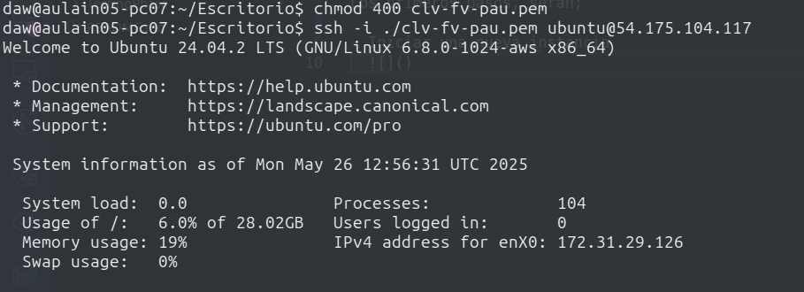
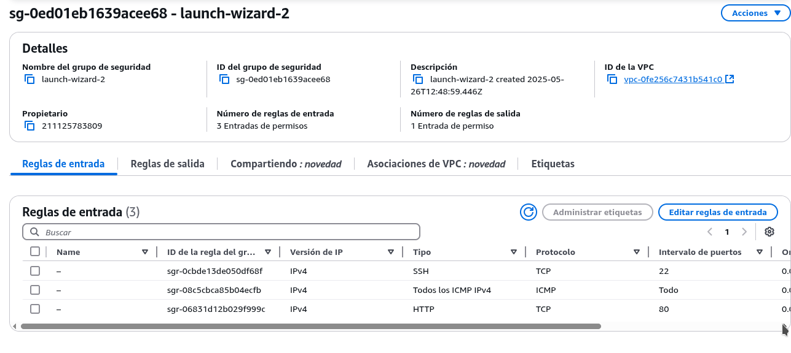
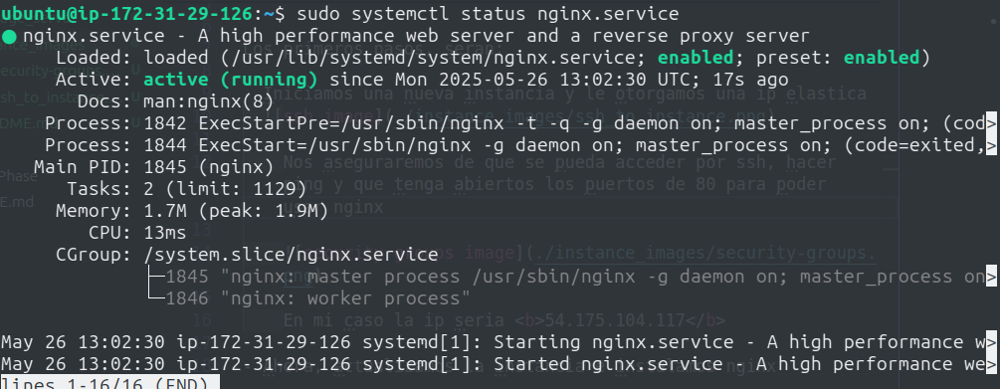
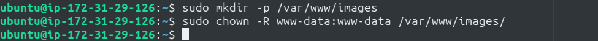
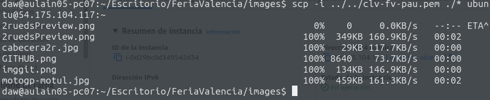
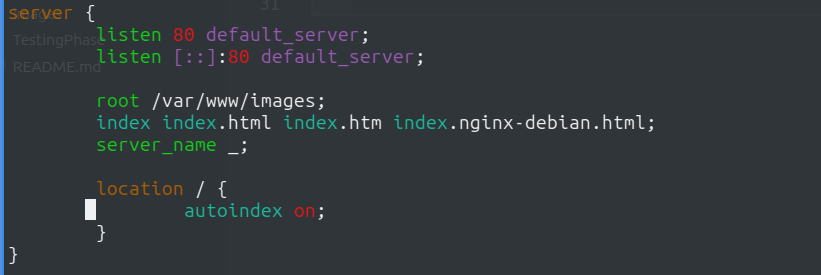
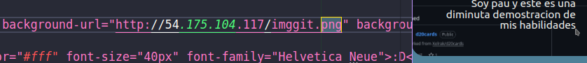
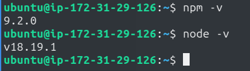

# AWS EC2 Setup

> Vamos a crear y configurar un servidor para tener localizadas nuestras imagenes, archivos mjml y mail
>

Los primeros pasos, seran;

- Iniciamos una nueva instancia y le otorgamos una ip elastica
  
sudo apt install npm

    Nos aseguraremos de que se pueda acceder por ssh, hacer ping y que tenga abiertos los puertos de 80 para poder usar nginx

    

    En mi caso la ip seria <b>54.175.104.117</b>

- Ahora, actualizamos la instancia e instalamos nginx
    

- Creamos la carpeta para servir las imagenes y le damos permisos para el gesetor de www:
    

    > En este caso hay dos opciones, instalar filezilla o copiar las imagenes mediante scp, como es una prueba hare la segunda opcion y dejare la primera como [WIP].

- Copiamos las imagenes a nuestro servidor, por accidente copie todo en home sin comprimirlo, ademas como www es una carpeta protegida nos dejaria copiarlo ahi directamente:
    
    

    Ahora que estan todas las imagenes, vamos a configurar el nginx:

    Modificamos el archivo '/etc/nginx/sites-available/default' para que quede tal que asi:
    
    

    Una vez esto, ejecutamos 'sudo nginx -t' y si, sale sin errores, 'sudo systemctl reload nginx'.

    Vamos al navegador, y usando la ip elastica + el nombre de la imagen tendremos esto:

    

- Probamos si funciona en mjml, camos a enviarnos un mail-tester usando la ip en las imagenes:

Aqui ya podemos ver que si probamos en vs si que funciona.

## Vamos a instalar node.js para pasar los archivos mjml a html

- Tras instalar vemos la version:  

