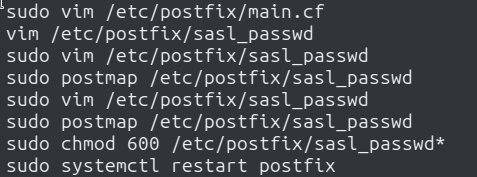
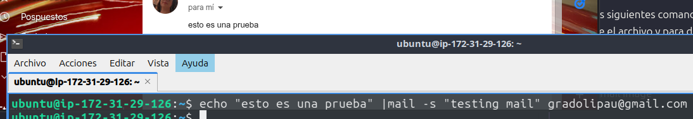
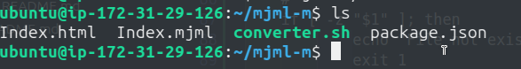

# AWS EC2 Setup

> Vamos a crear y configurar un servidor para tener localizadas nuestras imagenes, archivos mjml y mail
>

Los primeros pasos, seran;

- Iniciamos una nueva instancia y le otorgamos una ip elastica
    
sudo apt install npm

    Nos aseguraremos de que se pueda acceder por ssh, hacer ping y que tenga abiertos los puertos de 80 para poder usar nginx

    

    En mi caso la ip seria <b>54.175.104.117</b>

- Ahora, actualizamos la instancia e instalamos nginx
    

- Creamos la carpeta para servir las imagenes y le damos permisos para el gesetor de www:
    

    > En este caso hay dos opciones, instalar filezilla o copiar las imagenes mediante scp, como es una prueba hare la segunda opcion y dejare la primera como [WIP].

- Copiamos las imagenes a nuestro servidor, por accidente copie todo en home sin comprimirlo, ademas como www es una carpeta protegida nos dejaria copiarlo ahi directamente:
    
    

    Ahora que estan todas las imagenes, vamos a configurar el nginx:

    Modificamos el archivo '/etc/nginx/sites-available/default' para que quede tal que asi:
    
    

    Una vez esto, ejecutamos 'sudo nginx -t' y si, sale sin errores, 'sudo systemctl reload nginx'.

    Vamos al navegador, y usando la ip elastica + el nombre de la imagen tendremos esto:

    

- Probamos si funciona en mjml, camos a enviarnos un mail-tester usando la ip en las imagenes:

Aqui ya podemos ver que si probamos en vs si que funciona.

## Instalamos mailutils  
 Instalamos mailutils y postfix y configuramos  
   
    Editamos el main.cf para que quede tal que asi:  

       relayhost = [smtp.gmail.com]:587
        smtp_use_tls = yes
        smtp_sasl_auth_enable = yes
        smtp_sasl_password_maps = hash:/etc/postfix/sasl_passwd
        smtp_sasl_security_options = noanonymous 
        mynetworks = 127.0.0.0/8 [::ffff:127.0.0.0]/104 [::1]/128
        mailbox_size_limit = 0
        recipient_delimiter = +
        inet_interfaces = all
        inet_protocols = ipv4
            

Ahora, como veis, el archivo referencia a otro (sasl_passwd) que se encarga de manejar las credenciales del mail, este esta escrito tal que asi:  
    `[smtp.gmail.com]:587   {your@mail}:{password}`

Tendremos que abrir los puertos del EC2 587

Los siguientes comandos, seran para decirle al postmap que use el archivo y para darle permisos. Luego reiniciamos el servicio.

Con esto ya podemos enviar un mail: probaremos tal que asi:

## Cremos un script para convertir el fichero mjml a html

converter.sh >>

    #!/bin/bash
    #
    #       Pau Gradoli 
    #
    #       v.0.1
    #
    if [ -z "$1" ]; then
            echo "File not exists"
            exit 1
    fi

    file=$1
    salida="${file%.mjml}.html"

    mjml "$file" -o "$salida" && echo "Convertido a $salida"

